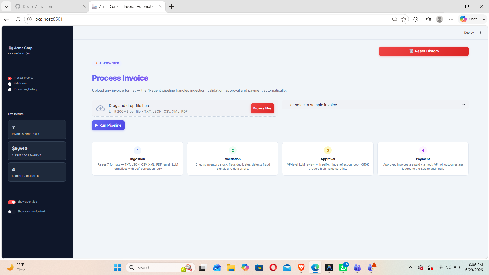
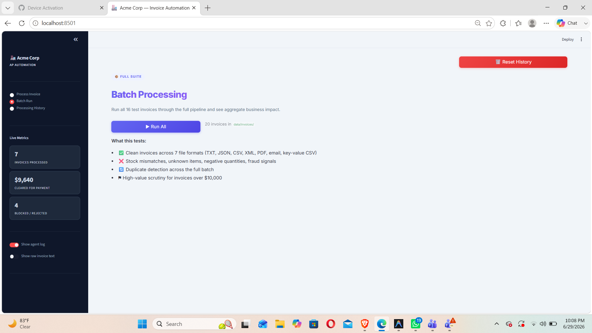
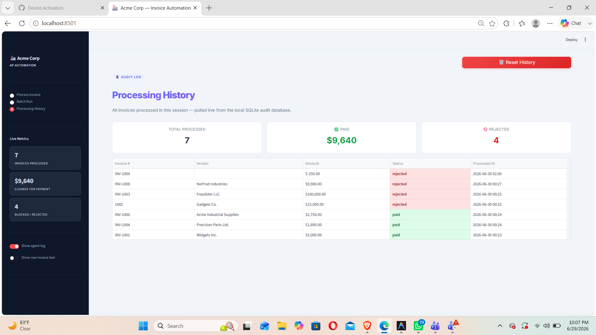

# Acme Corp Invoice Processing Automation

Acme Corp is a PE-backed manufacturer losing **$2M/year** to manual invoice processing: 30% error rates, 5-day delays, and no audit trail. This system replaces that workflow with a fully automated, 4-agent pipeline that ingests any invoice format, validates against inventory, applies VP-level approval logic, and processes payment — all with no human intervention for routine cases.

---

## Screenshots

**Home**


**Batch Run**


**Processing History**


---

## Setup & Installation

**1. Install dependencies**
```bash
pip install -r requirements.txt
```

**2. Configure your API key**

Copy `.env.example` to `.env` and add your key:
```bash
cp .env.example .env
```
```env
XAI_API_KEY=your_xai_key_here
# Fallback: OPENAI_API_KEY=your_openai_key_here
```

**3. Initialise the database**
```bash
python setup_db.py
```
Creates `inventory.db` with the inventory table and a `processed_invoices` table for duplicate detection and audit logging. Re-run at any time to reset.

---

## How to Run

**Single invoice (CLI)**
```bash
python main.py --invoice_path data/invoices/invoice_1001.txt
python main.py --invoice_path data/invoices/invoice_1003.txt --verbose
```

**Batch (all 16 test invoices)**
```bash
python main.py --batch data/invoices/
```
Exports `batch_results.json` on completion.

**Streamlit UI**
```bash
streamlit run ui/app.py
```
Opens at `http://localhost:8501`. Supports file upload, sample invoice picker, batch run, and processing history with CSV export.

> **Testing tip:** The system records every processed invoice in SQLite for duplicate detection. Re-running the same invoice will flag it as a duplicate. Use the **Reset History** button (top right of the UI) or re-run `python setup_db.py` to clear the audit log between test runs.

---

## Architecture

```
Invoice File
     |
     v
+-------------+     +--------------+     +--------------+     +-------------+
|  INGESTION  |---->|  VALIDATION  |---->|   APPROVAL   |---->|   PAYMENT   |
|             |     |              |     |              |     |             |
| Format-     |     | Inventory DB |     | LLM + self-  |     | Mock API +  |
| aware parse |     | checks +     |     | critique     |     | SQLite      |
| + LLM norm  |     | dupe detect  |     | reflection   |     | audit log   |
| + retry     |     |              |     | loop         |     |             |
+-------------+     +--------------+     +--------------+     +-------------+
     | error              | duplicate          | rejected
     +--------------------> END <-------------+
```

---

## Agent Descriptions

### 1. Ingestion Agent

Converts any invoice file into a validated `InvoiceData` Pydantic model using a two-stage approach.

**Stage 1 (format-aware parsing):** Extracts clean intermediate text from 7 formats without LLM cost: TXT, JSON (including nested vendor objects), CSV-columnar, CSV-key-value, XML, PDF (via pdfplumber), and plain-text email bodies (detected by `From:`/`Subject:` headers).

**Stage 2 (LLM normalisation):** Grok-3 maps the intermediate text to a strict JSON schema with instructions for item name normalisation, date parsing, and currency handling.

**Self-correction loop:** If the LLM output fails schema validation, the agent retries up to 2 times, feeding the specific error back into the prompt so Grok fixes its own output rather than starting from scratch.

**Heuristic anomaly detection** runs post-extraction and flags: fraud language (`urgent`, `wire transfer`, `pay immediately`), non-USD currency, missing vendor, negative quantities, OCR artifacts (letter O in numeric contexts), and math mismatches (accounting for tax).

### 2. Validation Agent

Validates extracted data against the SQLite inventory database.

- **Duplicate detection:** Checks the `processed_invoices` table. Revisions (e.g. `INV-1004_revised`) receive a WARNING instead of a hard rejection and proceed for human review.
- **Required-field checks:** Vendor, due date, positive total, at least one line item.
- **Aggregate stock checking:** Quantities for the same item across multiple rows are summed before checking inventory (critical for INV-1013 where GadgetX appears across 4 rows totalling 9 units against stock of 5).
- **Fuzzy item name matching:** Strips spaces and lowercases before lookup (`"Widget A"` to `"WidgetA"`) to handle OCR variants.
- Severity levels: `error` (blocks approval), `warning` (flags for review), `info` (logged only).

### 3. Approval Agent

Simulates VP-level review with an LLM reasoning and reflection loop.

- **Fast-path auto-approve:** Invoices with no errors, no fraud flags, and total under $10,000 are approved without an LLM call, keeping latency low for routine invoices.
- **High-value scrutiny:** Invoices over $10,000 trigger an enhanced review prompt that explicitly weighs financial risk.
- **Reflection loop:** The agent makes an initial decision, then runs a second self-critique prompt that challenges its own reasoning and may revise the verdict.

### 4. Payment Agent

Closes the loop regardless of approval outcome.

- **Approved:** Calls `mock_payment()` and records the invoice in `processed_invoices` with `status=paid`.
- **Rejected:** Records with `status=rejected` and logs the full rejection reasoning.
- Both paths write to the audit log, so duplicate detection works correctly on resubmission.

---

## Test Invoice Coverage

All 16 provided invoices are handled and verified:

| Invoice | Format | Scenario | Expected Outcome |
|---|---|---|---|
| INV-1001 | TXT | Standard clean invoice | PAID |
| INV-1002 | TXT | GadgetX qty 20 vs stock 5 | REJECTED: exceeds stock |
| INV-1003 | TXT | FakeItem (0 stock) + fraud language | REJECTED: zero stock + fraud signals |
| INV-1004 | JSON | Clean invoice with tax | PAID |
| INV-1004_revised | JSON | Revision of already-processed invoice | WARNING: revision flagged, proceeds for review |
| INV-1005 | JSON | Nested vendor object, high value >$10K, GadgetX exceeds stock | REJECTED: stock mismatch |
| INV-1006 | CSV | Key-value CSV layout (`field,value` rows) | PAID |
| INV-1007 | CSV | Columnar CSV (one item per row) | PAID |
| INV-1008 | TXT | Email body format, unknown items (SuperGizmo, MegaSprocket) | REJECTED: unknown items |
| INV-1009 | JSON | Negative quantity, missing vendor, negative total | REJECTED: multiple data errors |
| INV-1010 | TXT | Same item on multiple rows, shipping line, tax | PAID |
| INV-1011 | PDF | Clean PDF invoice | PAID |
| INV-1012 | PDF | PDF with OCR artefacts (letter O in numbers) | Flagged, processed with warnings |
| INV-1013 | JSON/PDF | Split quantities across 8 rows; GadgetX total 9 > stock 5 | REJECTED: aggregate stock exceeded |
| INV-1014 | XML | XML invoice format | PAID |
| INV-1015 | CSV | Columnar CSV with totals footer rows | PAID |
| INV-1016 | JSON | Unknown item (WidgetC not in inventory) | REJECTED: unknown item |

---

## Above & Beyond

**7 format parsers:** Plain text, JSON (including nested vendor objects), two CSV layouts, XML, PDF, and raw email bodies. The parser auto-detects format and routes accordingly with no LLM cost at the parsing stage.

**Aggregate stock checking:** Validation sums quantities per item across all line rows before checking inventory. This correctly catches INV-1013 where GadgetX is split across 4 entries (5 + 3 + 1 = 9 units against stock of 5). A naive per-row check would pass it incorrectly.

**Revision detection:** INV-1004_revised is detected as a revision of an already-processed invoice. Instead of hard-rejecting as a duplicate, the system issues a warning and passes it through for human review, matching real AP workflow.

**Fraud signal detection:** The ingestion agent scans raw text for 8 urgency/fraud patterns (`wire transfer`, `pay immediately`, `avoid penalties`, etc.) and surfaces them as flags that feed into the approval decision.

**OCR artifact detection:** Regex scan for letter O/o appearing in numeric contexts (e.g. `3,5O0.00`) flags potential OCR corruption from scanned PDFs.

**Self-correction loop:** Ingestion retries up to 2x on schema validation failure, passing the specific error back to Grok so it can fix the extraction rather than restart.

**Reflection/critique loop:** The approval agent runs a second LLM call to critique its own initial decision before finalising, reducing false rejections on borderline invoices.

**Streamlit UI:** Full interactive interface with drag-and-drop upload, sample invoice picker, 4-stage pipeline visualisation, per-tab breakdown (Invoice, Validation, Approval, Payment), live inventory check table, confidence bar, risk badge, and self-critique expander.

**Batch mode:** Processes an entire directory via the UI or CLI (`--batch`), displays aggregate business metrics (total cleared, blocked, fraud detected, time saved vs manual), and exports `batch_results.json`.

**Processing history with CSV export:** Every processed invoice is written to SQLite with timestamp, amount, vendor, and status. The History tab in the UI displays the full audit trail and supports one-click CSV download directly from the table.

**Audit database:** Persistent audit trail across sessions. Duplicate detection works even if the app is restarted between runs.

---

## Design Decisions

**Why LangGraph?** StateGraph gives a clean separation between agent logic and routing logic. The `operator.add` reducer on `processing_log` means each agent appends to the log without overwriting, avoiding state merge bugs across nodes.

**Why two-stage parsing?** Feeding raw PDFs or email bodies directly to the LLM is expensive and inconsistent. The format-specific parser handles structural extraction cheaply; the LLM only handles semantic normalisation. This also makes the system resilient to LLM API failures since the parse step always succeeds.

**Why `import tools.llm as llm` instead of `from tools.llm import chat_json`?** The module-level import pattern ensures `unittest.mock.patch('tools.llm.chat_json')` intercepts calls correctly. Direct function imports create a local binding that bypasses the patch.

**Why always route to the payment agent on rejection?** Rejected invoices still need to be recorded in the audit database. Routing rejections directly to END would skip that step, leaving the audit log incomplete and allowing the same invoice to pass duplicate detection on resubmission.
